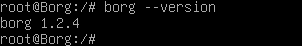
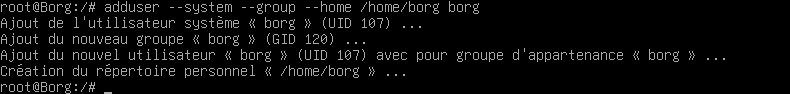
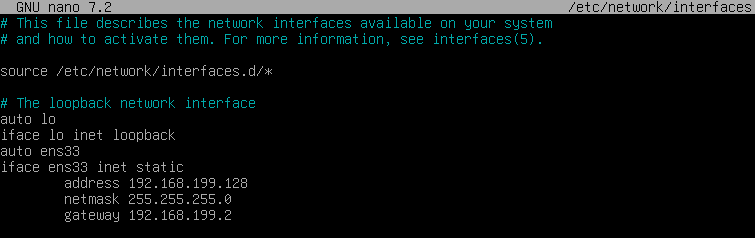

**Auteur :** Maxime COURBOULIN  |  **Date :** 2026-03-10 00:00:00

Prérequis : avoir une machine sous Debian (ici Debian 12)

# Installation

Dans le terminal

```sh
sudo apt update
sudo apt install borgbackup -y
```


## Vérification de version



## Création utilisateur dédié Borg (sécurité)



# IP statique

```sh
sudo nano /etc/network/interfaces
```


