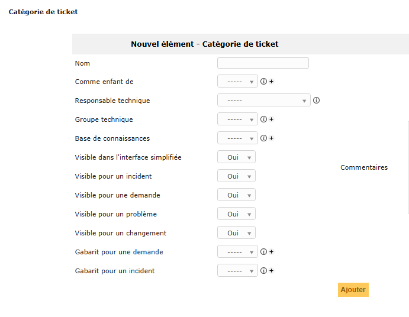
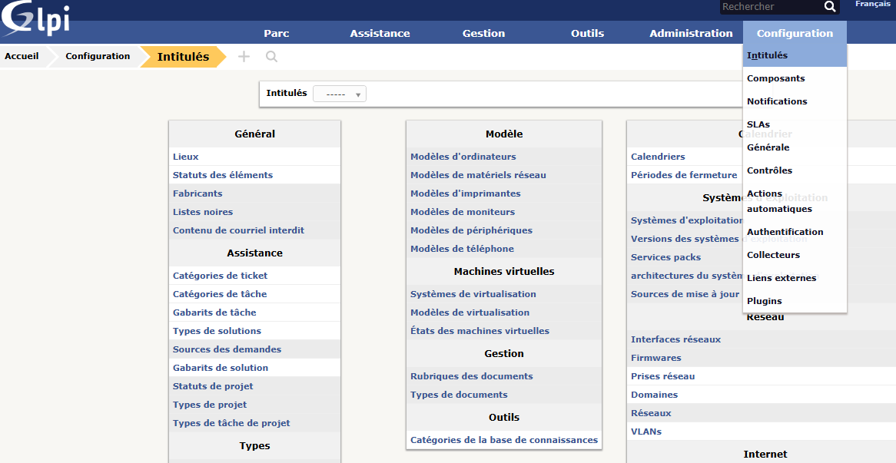
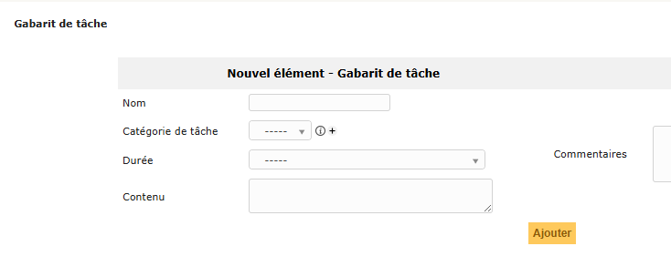
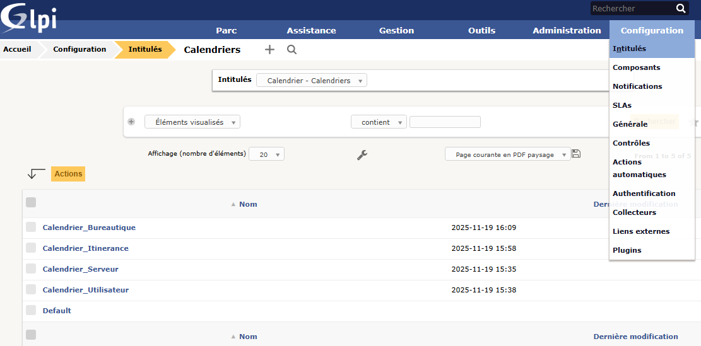
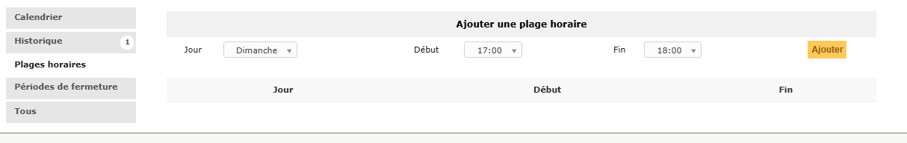
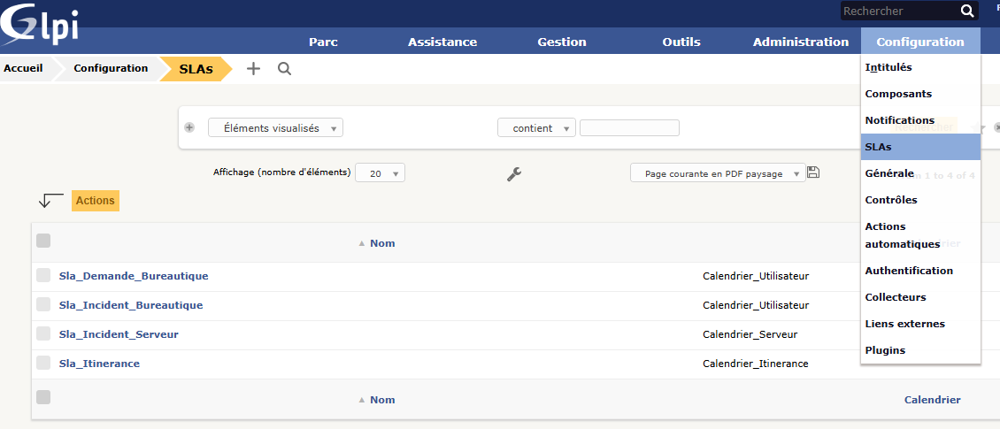
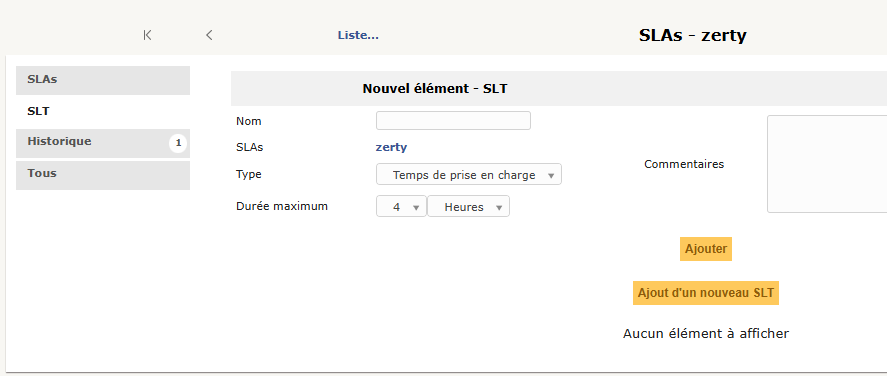

# 1 Ajouter une catégorie

# 2 Création gabarits

Gabarit de taches

# 3 Créer les calendriers

Cliquer sur **Envoyer**.

Sélectionner un calendrier, et définir les plages horaires pour chaque jour, un par un.

# 4 Créer des Service Level Agreement

## SLA

## SLT

