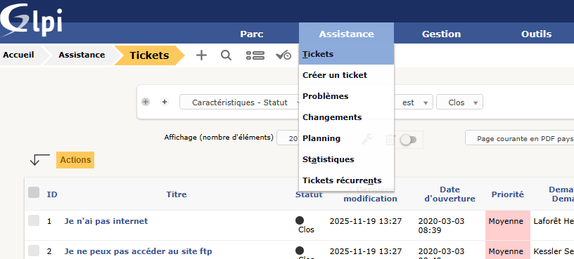
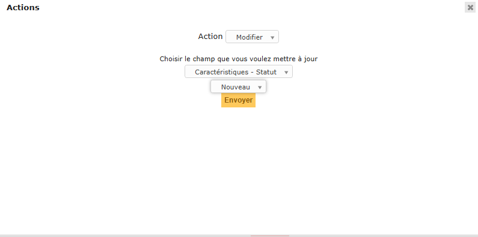
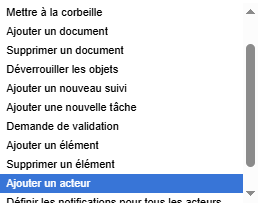
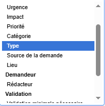

**Auteur :** Maxime COURBOULIN  |  **Date :** 2025-11-20 00:00:00
Pour apporter des modifications sur plusieurs tickets à la fois :

Se rendre dans l’espace de stockage des tickets à modifier.

Sélectionner mes tickets à modifier.

Cliquer sur `**Action**`, remplir les champs en fonction des besoins :

Cliquer sur `**Envoyer**` pour appliquer les modifications.
