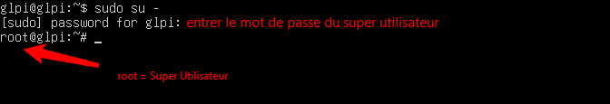
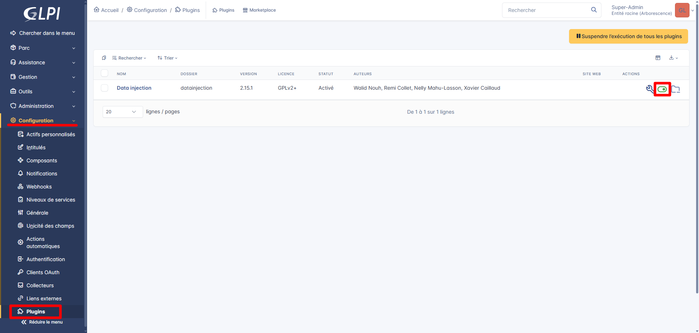
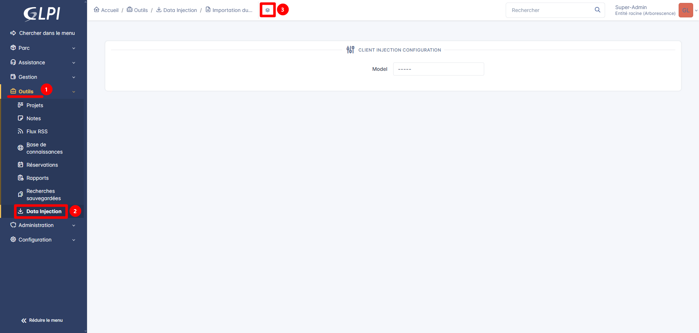
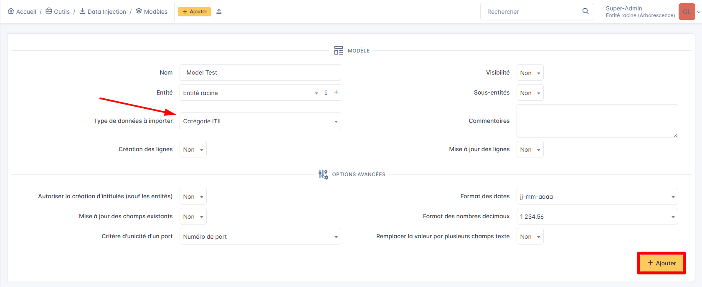
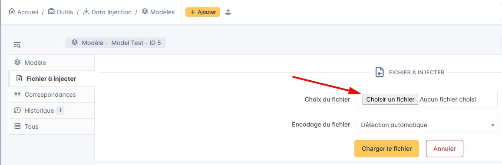
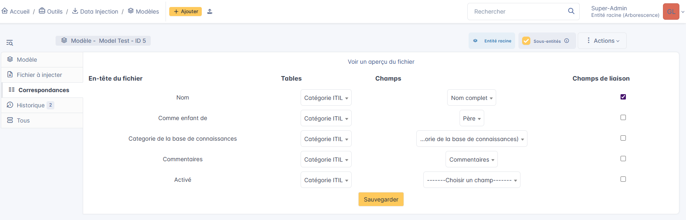
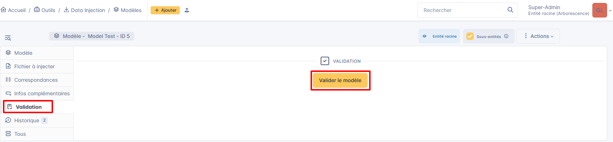
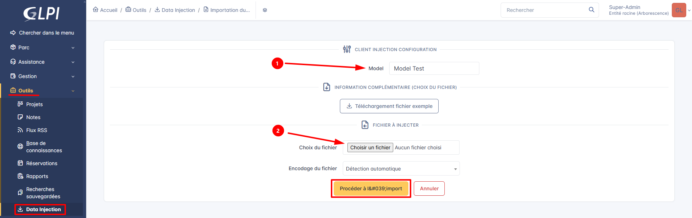

**Auteur :** \['Gautier RAYEROUX']  |  **Date :** 2025-11-24

***

## Prérequis

Vous devez au préalable avoir installé un serveur GLPI.

Passez sous le profil **super utilisateur** pour avoir tous les privilèges.

### Passer en super utilisateur

1. Entrer la commande suivante :

```plain text
sudo su -
```


2\. Entrer le mot de passe du compte super utilisateur, puis appuyer sur **Entrée**

***

## 1. Télécharger l'archive « datainjection »

3. Entrer les commandes suivantes pour télécharger et extraire le plugin :

```plain text
cd /var/www/html/glpi/plugins
wget https://github.com/pluginsGLPI/datainjection/releases/download/2.15.1/glpi-datainjection-2.15.1.tar.bz2
tar -xvf glpi-datainjection-2.15.1.tar.bz2
```

***

## 2. Installer le plugin

4. Sur l'interface GLPI, aller dans **« Configuration »** → **« Plugins »**
5. Sur la ligne **« Data Injection »**, activer le plugin



***

## 3. Créer un modèle d'injection

6. Dans **« Outils »**, cliquer sur **« Data Injection »**, puis sur l'icône **« Modèle »**
7. Cliquer sur **« Ajouter »**




8. Remplir les champs, choisir la catégorie de données à injecter, puis cliquer sur **« Ajouter »**



9. Sélectionner le fichier CSV à injecter pour préparer le modèle



10. Effectuer les correspondances entre les en-têtes CSV et les champs de la catégorie, puis cliquer sur **« Sauvegarder »**



11. Aller dans l'onglet **« Validation »**, puis cliquer sur **« Valider le modèle »**



***

## 4. Importer le fichier

12. Aller dans **« Outils »** → **« Data Injection »**
13. Sélectionner le modèle d'injection
14. Sélectionner le fichier CSV contenant les données
15. Cliquer sur **« Procéder à l'injection »**


