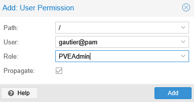

**Auteur :** Gautier RAYEROUX  |  **Date :** 2026-03-09

***

## Présentation du système de permissions

Proxmox VE utilise un système de **RBAC** (Role-Based Access Control). Chaque permission associe :

* un **Chemin** (scope de la ressource, ex. `/` pour tout le datacenter)
* un **Utilisateur** (compte local `@pam` ou LDAP)
* un **Rôle** (ensemble de droits prédéfinis)

### Rôles principaux

| Rôle                | Description                                               |
| ------------------- | --------------------------------------------------------- |
| `Administrator`     | Accès total (équivalent root)                             |
| `PVEAdmin`          | Administration complète sans modification des permissions |
| `PVEVMAdmin`        | Gestion des VMs uniquement                                |
| `PVEAuditor`        | Lecture seule                                             |
| `PVEDatastoreAdmin` | Gestion des stockages                                     |

***

## 1. Ajouter une permission utilisateur

1. Dans l'arborescence, sélectionner **Datacenter** → **Permissions** → **« Add »** → **« User Permission »**

2. Renseigner les champs :

   * **Path :** `/` (scope global — s'applique à tout le datacenter)
   * **User :** `gautier@pam`
   * **Role :** `PVEAdmin`
   * **Propagate :** coché (la permission se propage aux ressources enfants)

   Cliquer sur **« Add »**



:::note[Realm `@pam`]
Le realm **`pam`** correspond aux utilisateurs Linux locaux du nœud Proxmox (authentification PAM). Pour créer un utilisateur `gautier`, il faut d'abord le créer sur le système Debian sous-jacent :

```bash
adduser gautier
```

:::

:::caution[Bonne pratique]
Éviter d'utiliser `root@pam` pour les tâches courantes. Créer un compte personnel avec le rôle `PVEAdmin` permet de tracer les actions et de limiter les risques.
:::

***

## Récapitulatif des scopes de permissions

| Path             | Portée                                             |
| ---------------- | -------------------------------------------------- |
| `/`              | Datacenter entier (toutes les VMs, tous les nœuds) |
| `/nodes/pve`     | Nœud spécifique                                    |
| `/vms/100`       | VM spécifique (ID 100)                             |
| `/storage/local` | Stockage spécifique                                |
| `/pool/monpool`  | Pool de ressources                                 |
