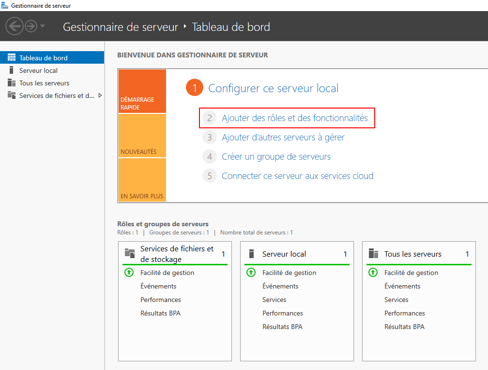

**Vérification des prérequis :**

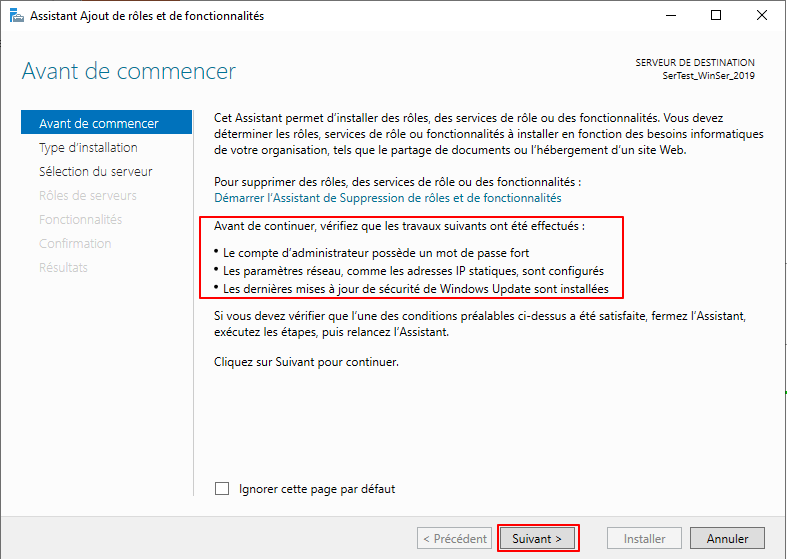

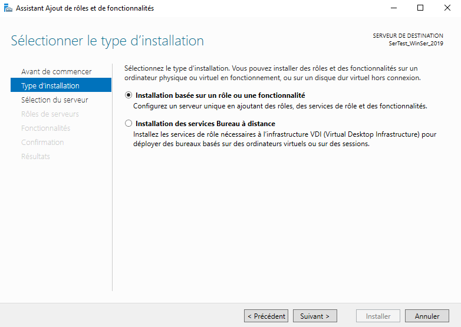

**Destination :**

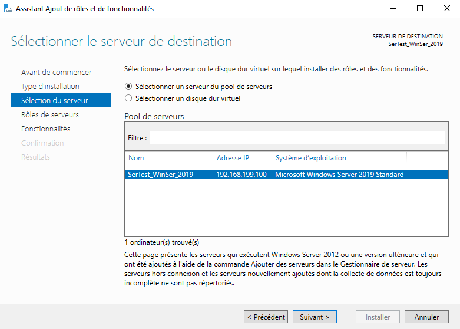

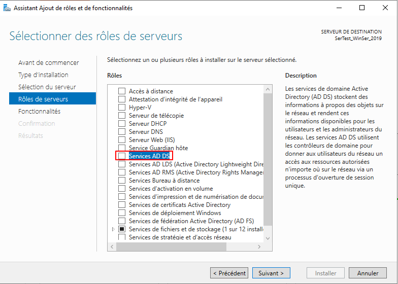

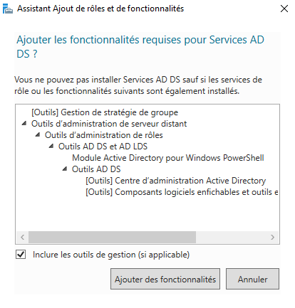

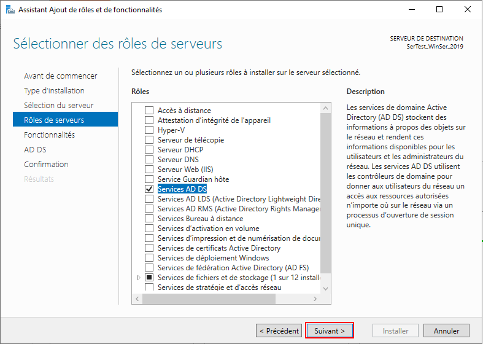

**Fonctionnalités obligatoires (automatique) :**

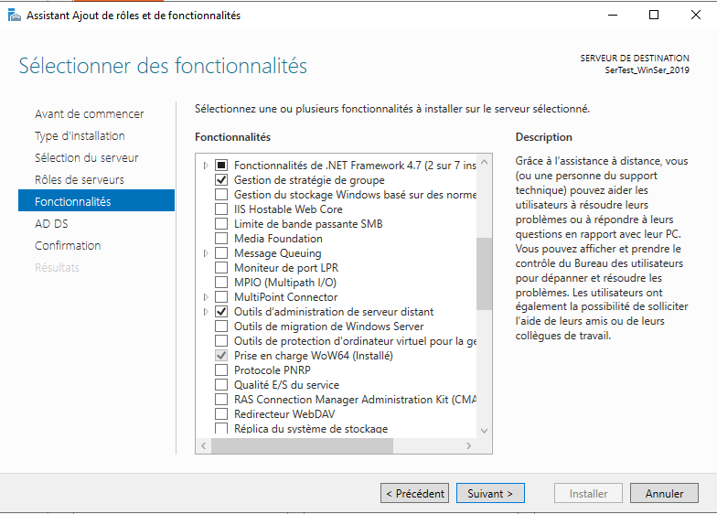

**Installation :**

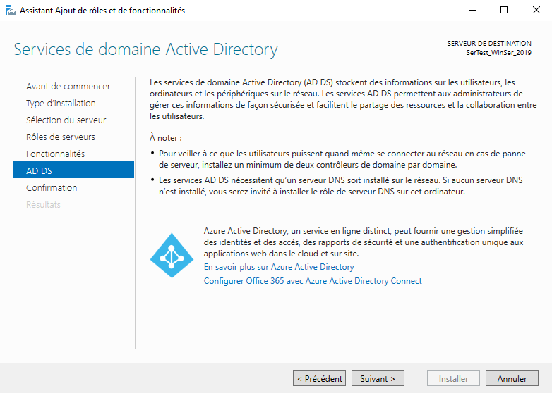

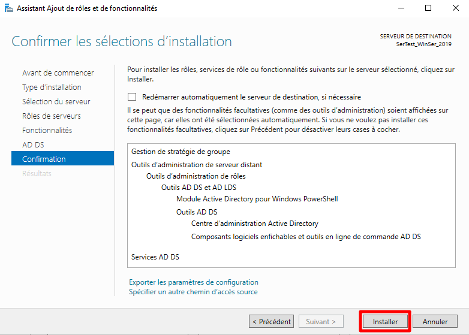

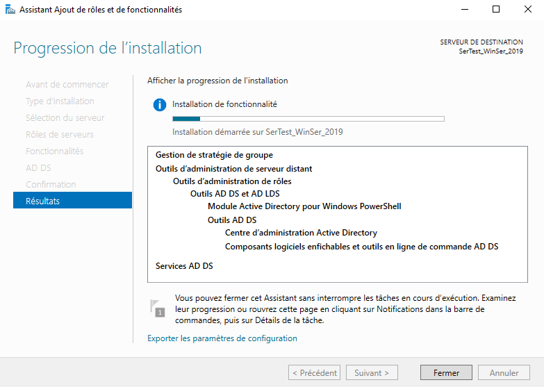

**Une fois finie, une notification nous invite à promouvoir le server** 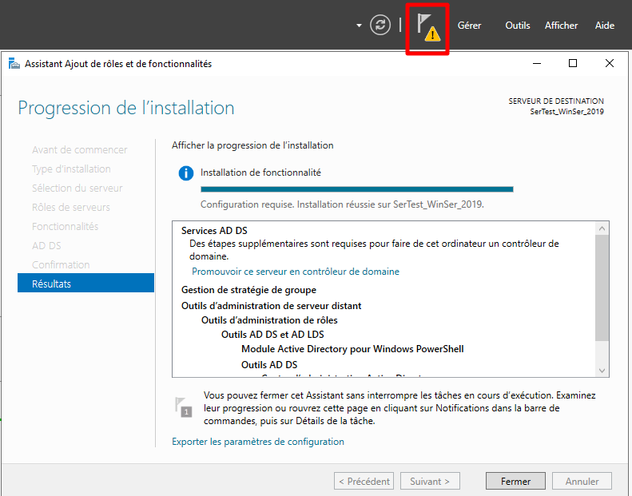

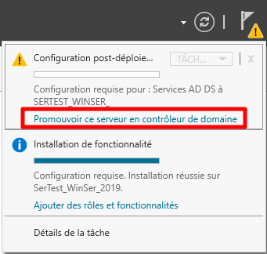

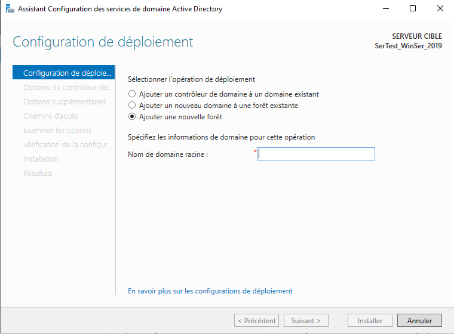

**Choisir un nom de domaine : NAS.internal (int. recommandé pour éviter les conflits)**

**Renseigner un mot de passe pour le mode restauration des services d’annuaire.**

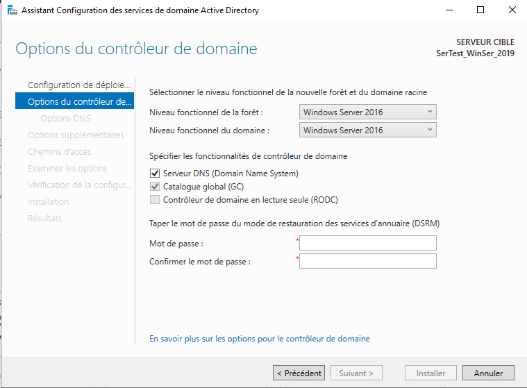

**Suivant pour créer sans serveur DNS :**

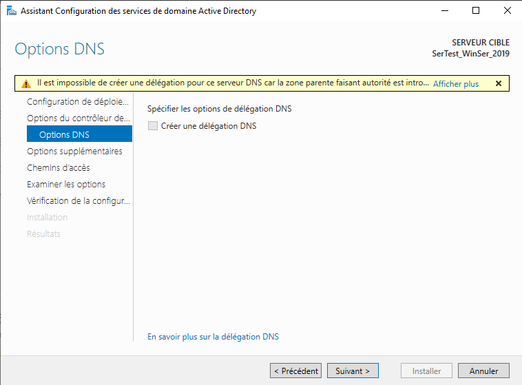

**Patienter**

**Le temps que le nom NetBIOS soit généré :**

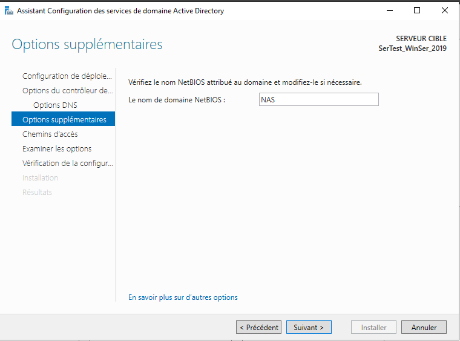

**Laisser le chemin tel quel, Suivant :**

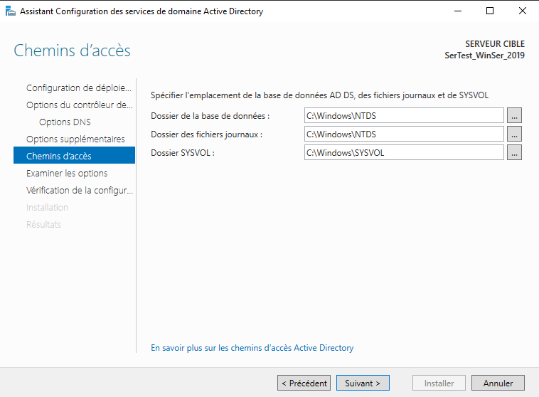

**Vérifier, si pas d’erreur : Suivant :**

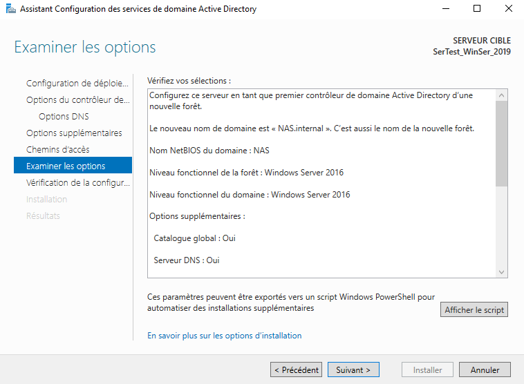

**Patienter :**

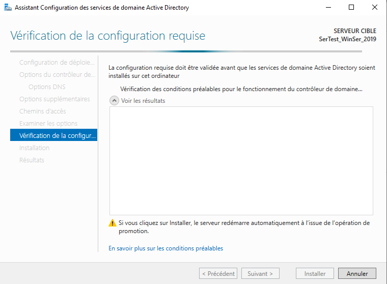

**Si OK, Suivant :**

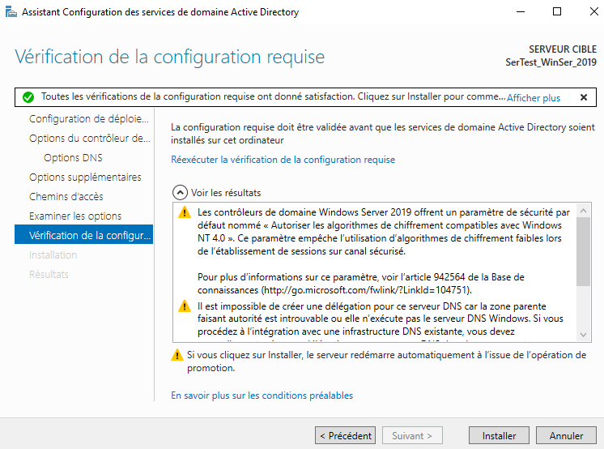

**Patienter pendant l’installation, puis redémarrer :**

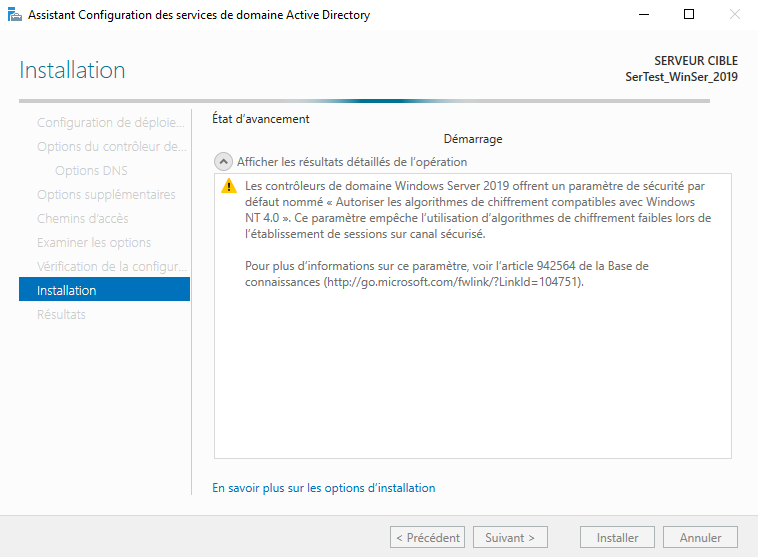

**Après installation, le server est opérationnel.**
