**Auteur :** `=this["Créée par"]`  |  **Date :** `=this["Date de création"]`

# Installation Windows Server Backup :

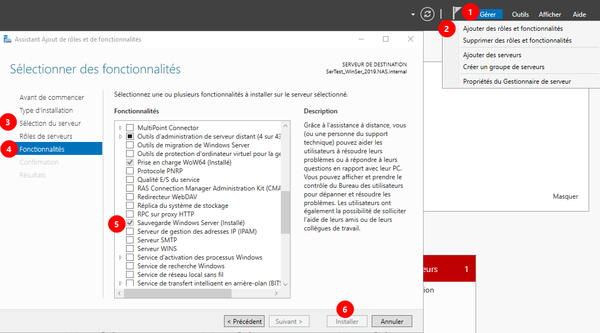

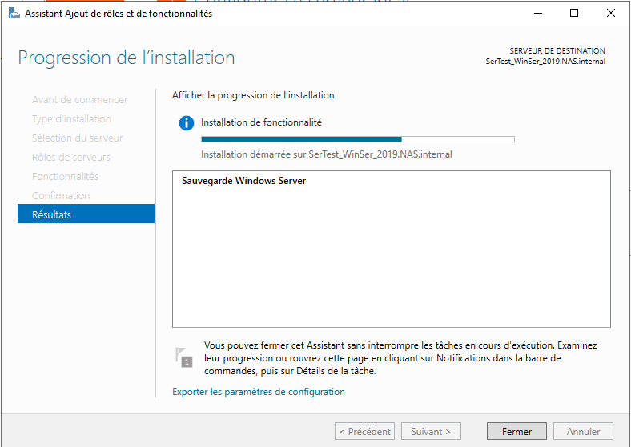

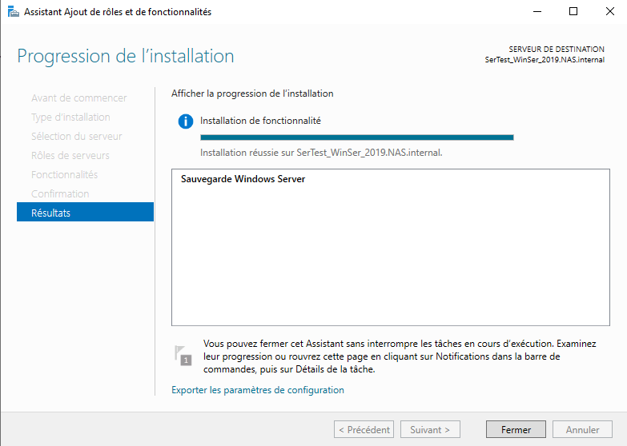

# Sauvegarde

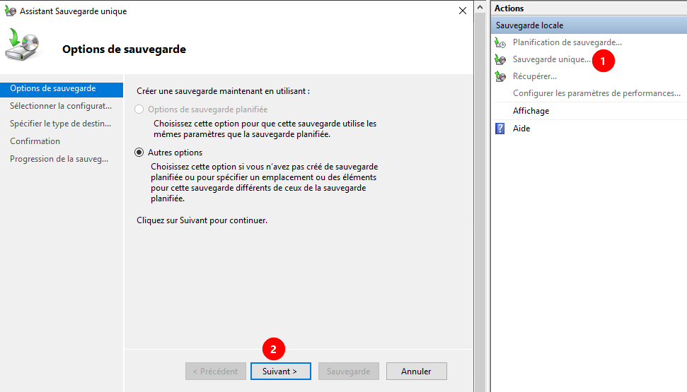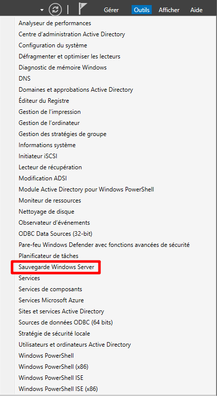

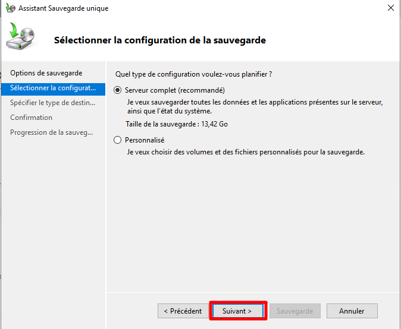

Destination :

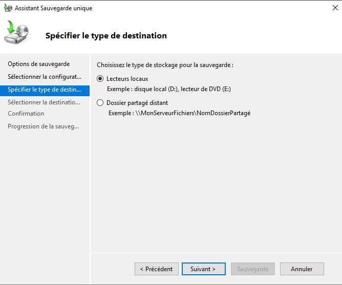

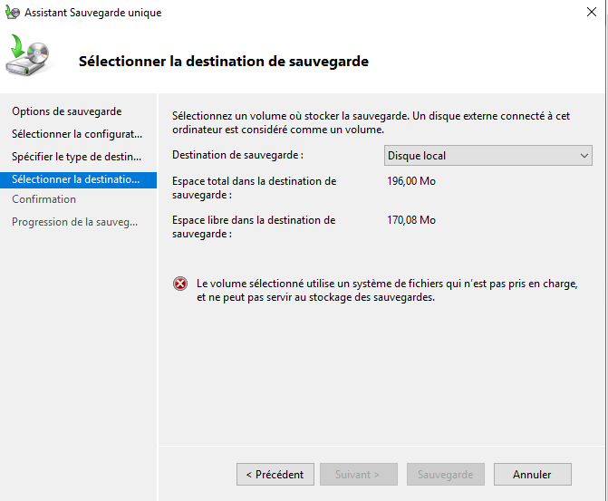

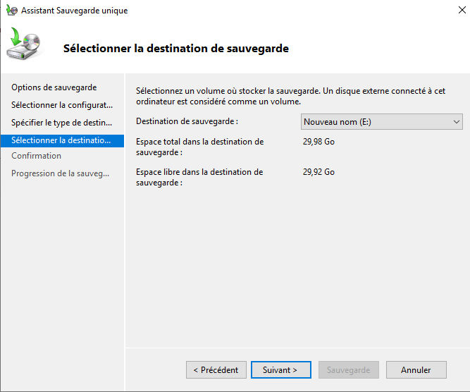

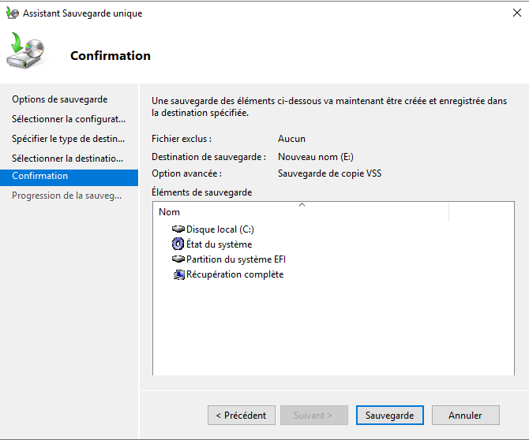

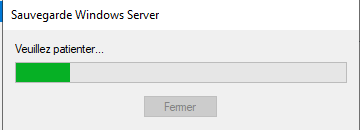

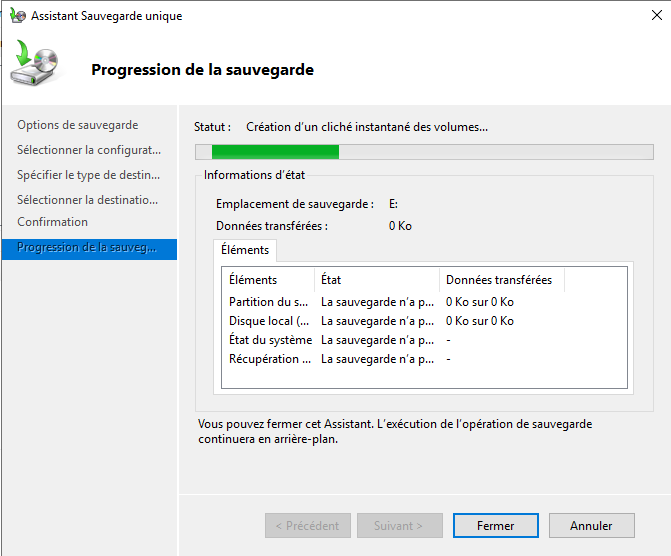

Information de l’avancée dans l’encart :

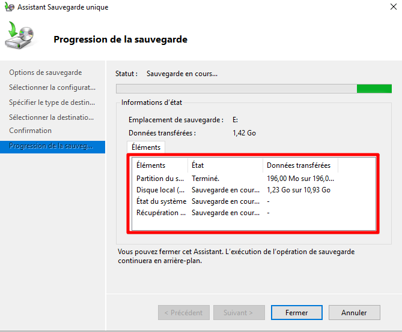

Sauvegarde terminée :

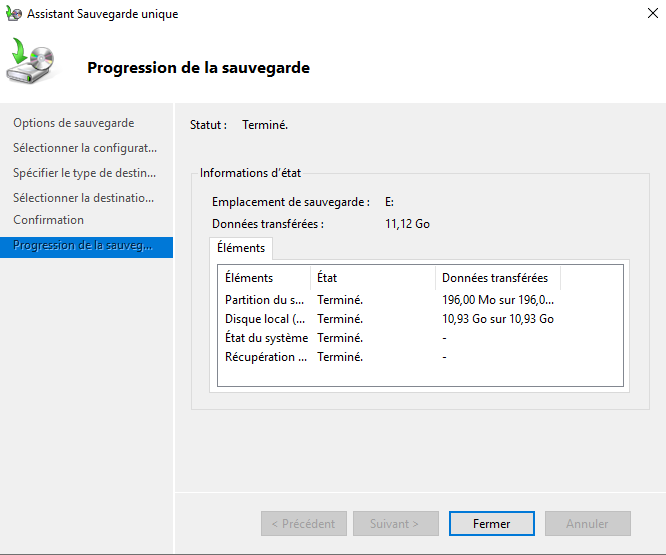
