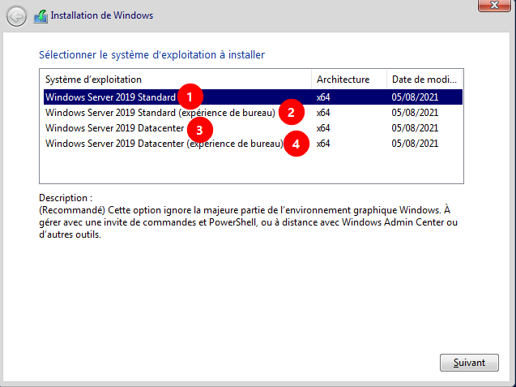
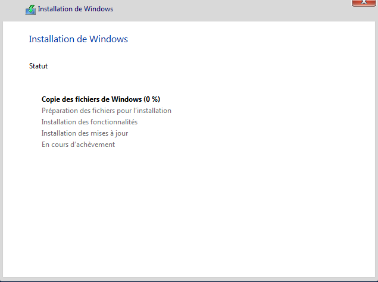
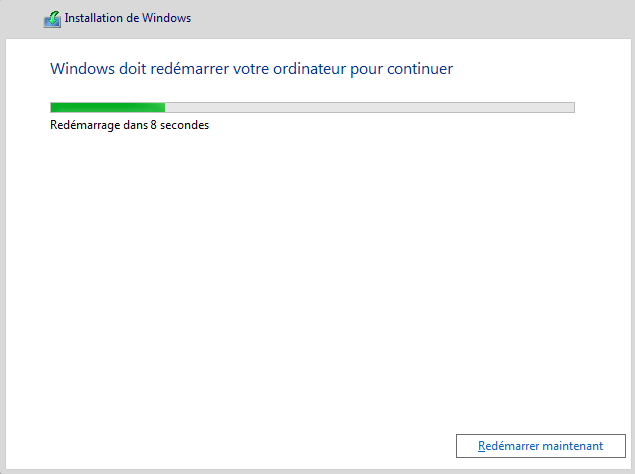
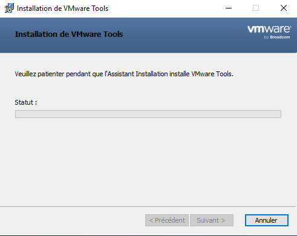
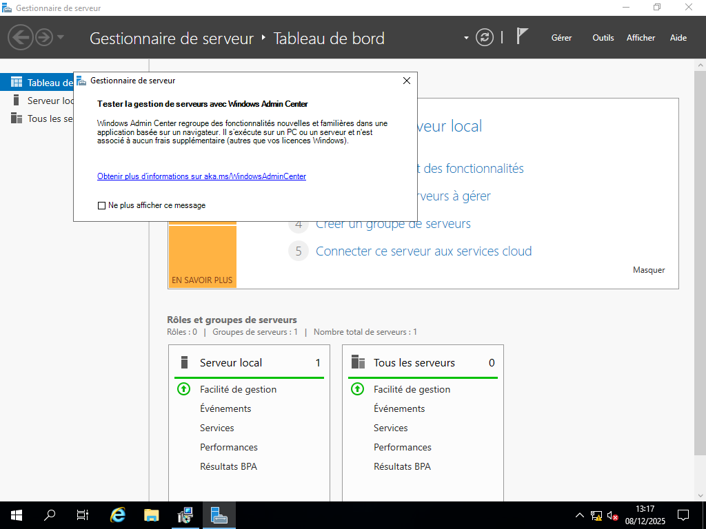
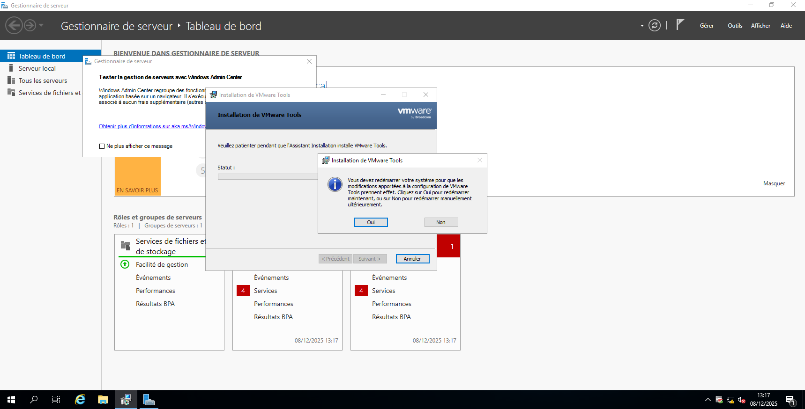
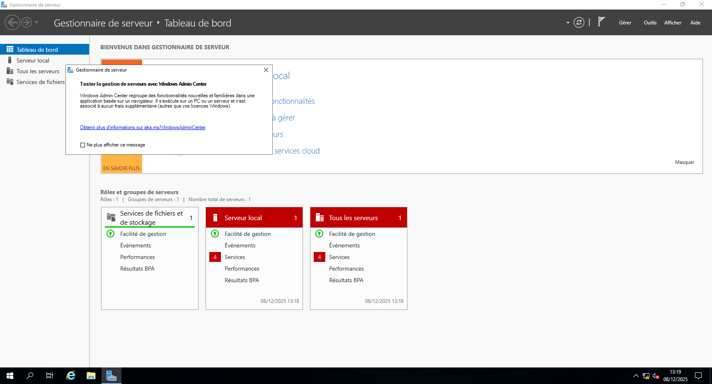

**Auteur :** Maxime COURBOULIN  |  **Date :** 2025-12-08 00:00:00

Prérequis à la mise en place de la procédure :

ISO windows server (2019)

Installation :

1. Version sans interface graphique, permet un nombre limité de machines virtuelles et qui possède une version d’évaluation.

2. Version avec interface graphique, permet un nombre limité de machines virtuelles et qui possède une version d’évaluation.

3. Version sans interface graphique, sans limite de machines virtuelles et qui ne possède pas une version d’évaluation.

4. Version sans interface graphique, sans limite de machines virtuelles et qui ne possède pas une version d’évaluation.

**Suivant :**

Se lance automatiquement :

Après redémarrage :

