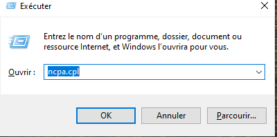
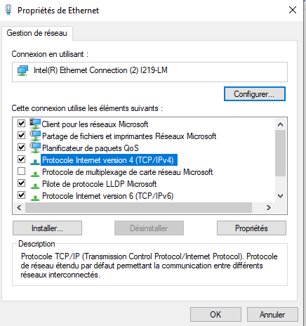
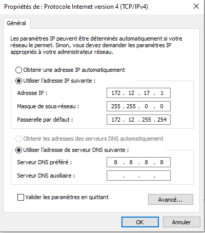

***Procédure changement adresse IP***

Désactiver DHCP pou passer en adresse IP statique sur Windows 10 professionnel

Vérifier DHCP activé :

* terminal : ipconfig /all
* DHCP activé : oui

Une fois vérification effectuée :

* W+r : ncpa.cpl

* « Ethernet » :` click droit -> propriété`
* `Protocole Interne Version 4 -> propriété`
  
* Changer IP et DNS
  
