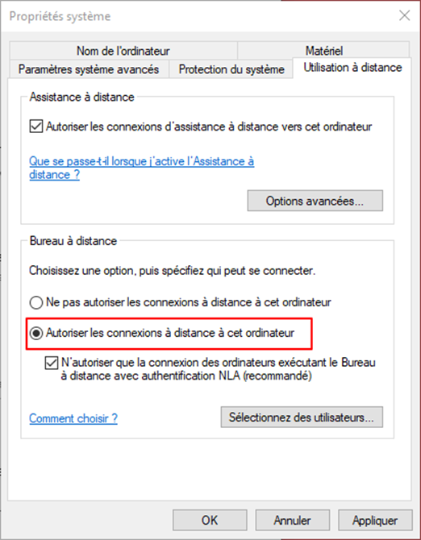
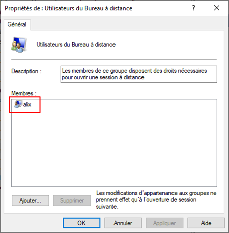
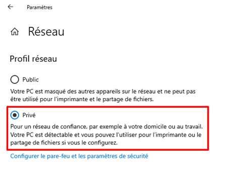
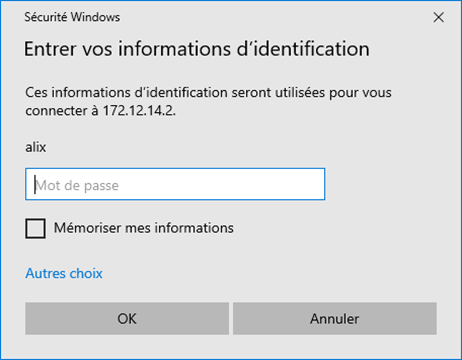
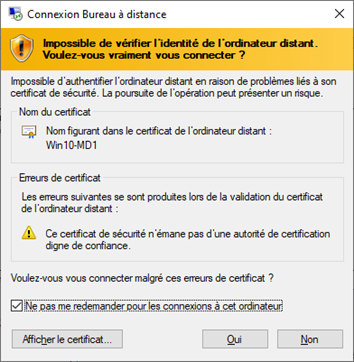

**Auteur :** `=this["Créée par"]`  |  **Date :** `=this["Date de création"]`

# Configuration du bureau à distance

<!-- Column 1 -->

Aller dans les « **Propriété systèmes** » avec la commande « **sysdm.cpl** ».

Sélectionner l’onglet « **Utilisation à distance** », puis choisir l’option « **Autoriser les connexions à distance à cet ordinateur »**.

<!-- Column 2 -->

## Autoriser les utilisateurs à se connecter à distance

<!-- Column 1 -->

Dans le gestionnaire de groupe, ajouter l’utilisateur qui sera en mesure de se connecter avec le bureau à distance.

<!-- Column 2 -->

## Connexion au bureau à distance

<!-- Column 1 -->

Avant de tenter une connexion, vérifier que les différentes machines soient sous un réseau privé.

<!-- Column 2 -->

<!-- Column 1 -->

Dans l’invite de commande, taper la commande « **mstsc /v:172.12.14.2** ». Renseigner les identifients d’un utilisateur autorisé, pui créer un certificat.

<!-- Column 2 -->

<!-- Column 3 -->

