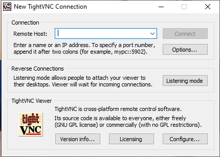
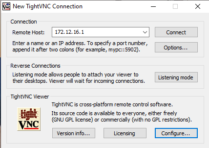

**Auteur :** Maxime COURBOULIN  |  **Date :** 2026-11-20 00:00:00

**1**

**1** adresse IP de la machine cible, cliquer sur **Connect**

**Une fois le travail terminé, cliquer sur la croix pour fermer la fenêtre met fin à la prise de main à distance.**
