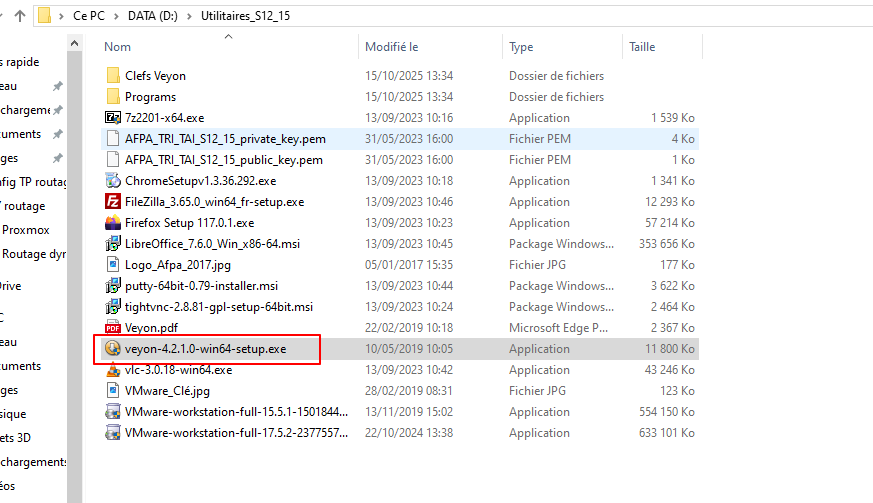
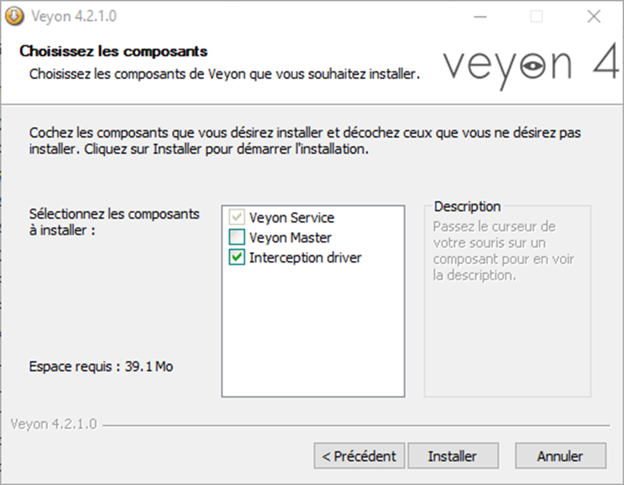
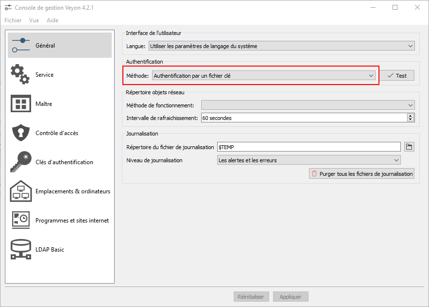
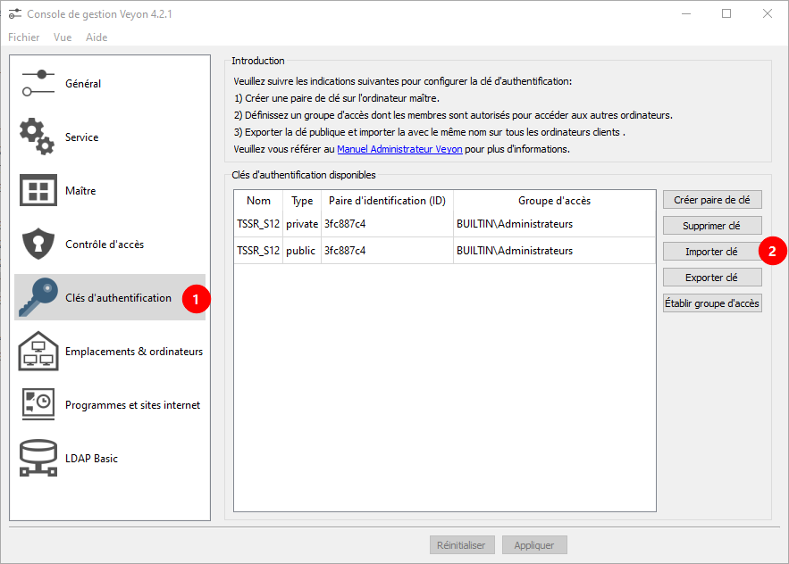
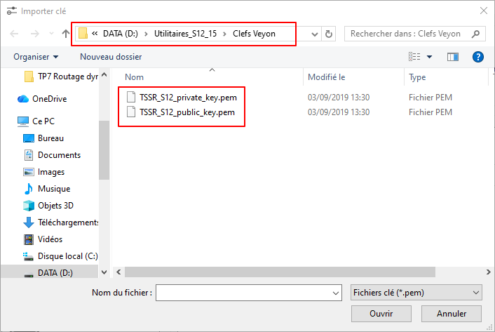
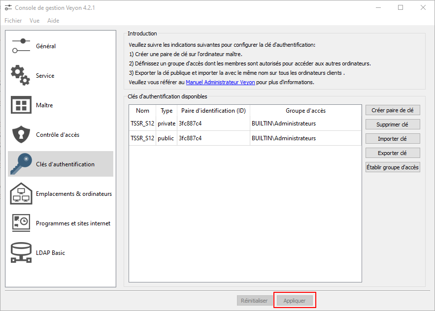

**Auteur :** `=this["Créée par"]`  |  **Date :** `=this["Date de création"]`

# Installation

Dans installation **décocher Veyon Master**

# Configuration

Dans la configuration **Général > Authentification par clé**

## Importer clés

Dans **Clé d’authentification > Importer clé**

Importer les deux clés dans le chemin suivant :

**Appliquer**

