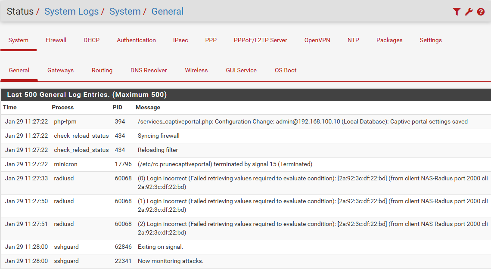
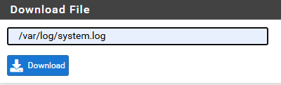
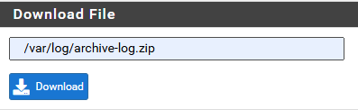

## 1. Consulter les logs

Aller dans **Status** → **System Logs** pour analyser le trafic de pfSense.



***

## 2. Télécharger les logs

### 2.1 Télécharger un fichier log spécifique

1. Aller dans **Diagnostics** → **Command Prompt**
2. Définir l'emplacement du fichier log à télécharger



### 2.2 Télécharger tous les logs

1. Passer en mode shell sur pfSense
2. Créer une archive du dossier log :

```plain text
zip -r archive-log.zip /var/log
```

3. Télécharger l'archive depuis **Diagnostics** → **Command Prompt**


