**Auteur :** `=this["Créée par"]`  |  **Date :** `=this["Date de création"]`

***

## 1. Création de règles de pare-feu

Aller dans **Firewall** → **Rules**, choisir l'interface où créer la règle, puis cliquer sur **« Add »**.

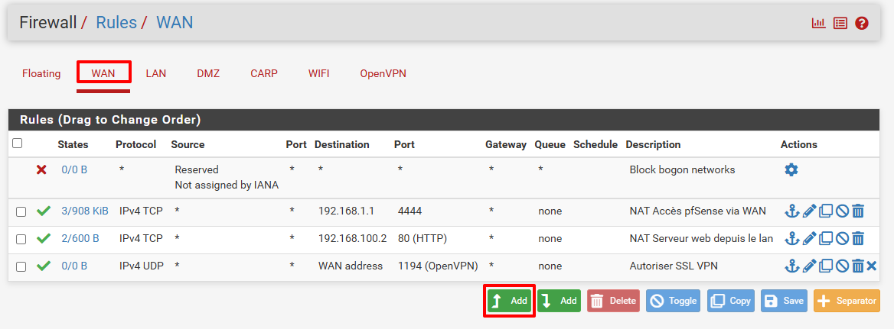

### Paramètres d'une règle

| Champ          | Description                                |
| -------------- | ------------------------------------------ |
| Action         | Autoriser, bloquer ou rejeter les paquets  |
| Disabled       | Désactiver la règle sans la supprimer      |
| Interface      | Interface sur laquelle s'applique la règle |
| Address Family | Famille d'adresse : IPv4 ou IPv6           |
| Protocol       | Protocole ciblé (TCP, UDP, ICMP…)          |

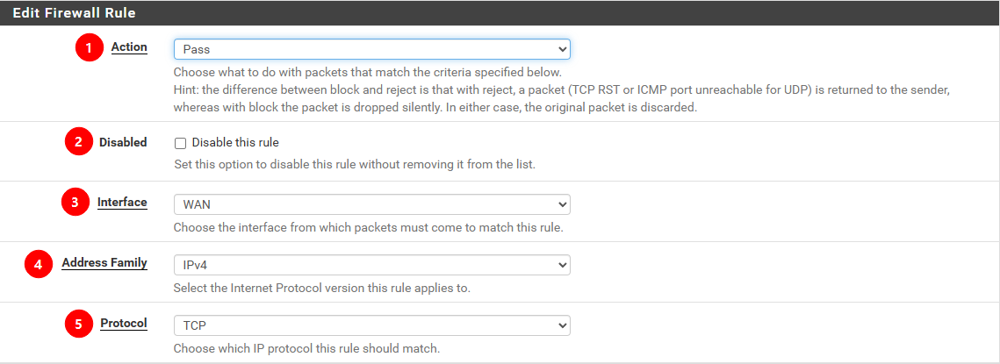

| Champ            | Description                        |
| ---------------- | ---------------------------------- |
| Source           | Source d'où arrivent les paquets   |
| Source Port      | Port(s) concerné(s) en source      |
| Destination      | Destinataire des paquets           |
| Destination Port | Port(s) concerné(s) en destination |

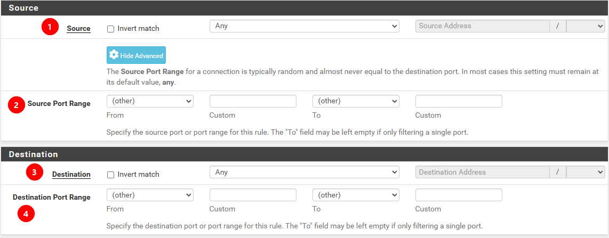

| Champ       | Description                                         |
| ----------- | --------------------------------------------------- |
| Log         | Enregistre les paquets dans le journal d'événements |
| Description | Description lisible de la règle                     |

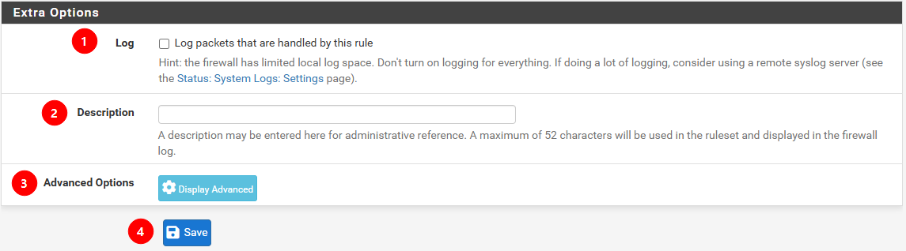

### Exemple de règle

> J'**autorise** sur l'interface **OpenVPN** à la famille d'adresse **IPv4** d'utiliser les protocoles **TCP/UDP**.
> J'autorise **toutes** les sources à aller sur le **LAN subnet** en utilisant le port **3389** (Bureau à distance).

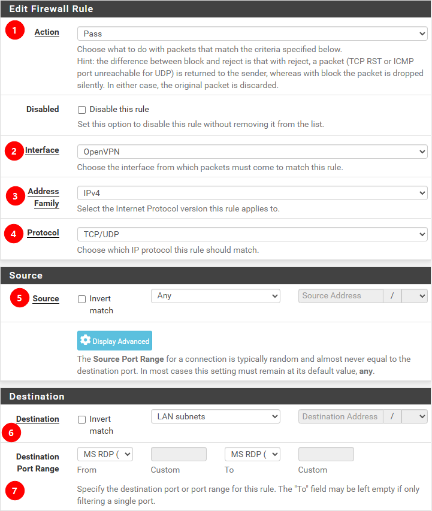

***

## 2. Création d'une redirection de port (NAT)

Aller dans **Firewall** → **NAT**, puis dans l'onglet **« Port Forward »**, créer une redirection avec **« Add »**.

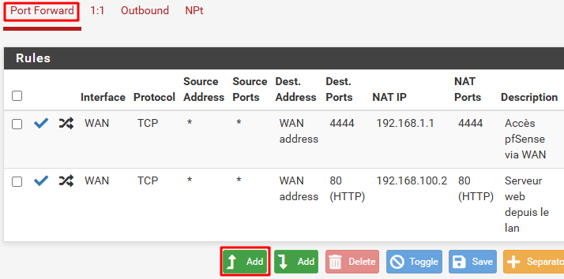

| Champ           | Description                                                         |
| --------------- | ------------------------------------------------------------------- |
| Disabled        | Désactiver la règle de redirection                                  |
| No RDR          | Désactiver la redirection des paquets correspondants à leur arrivée |
| Interface       | Interface sur laquelle s'applique la redirection                    |
| Address Family  | IPv4 ou IPv6                                                        |
| Protocol        | Protocole ciblé                                                     |
| Source          | Source avancée des paquets                                          |
| Destination     | Destination des paquets entrants                                    |
| Redirect target | Adresse de redirection                                              |
| Description     | Description de la règle                                             |

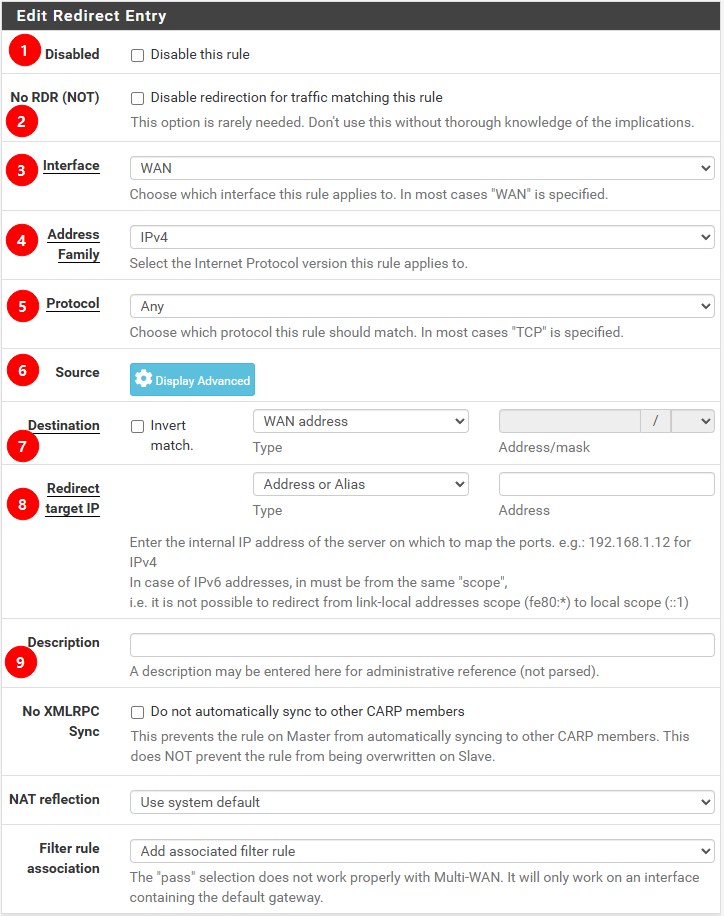

### Exemple de règle de redirection

> Sur l'interface **WAN** (IPv4 / TCP) : je redirige les sources arrivant sur **WAN address** vers l'adresse **192.168.100.2** sur le port **80** pour accéder au serveur web.

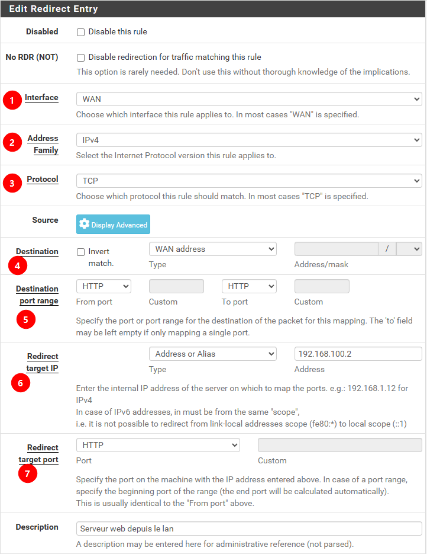

***

## 3. Paramétrage de la DMZ

### 3.1 Autoriser le LAN à naviguer sur le Web via le WAN

Ajouter une règle de pare-feu sur l'interface **LAN** :

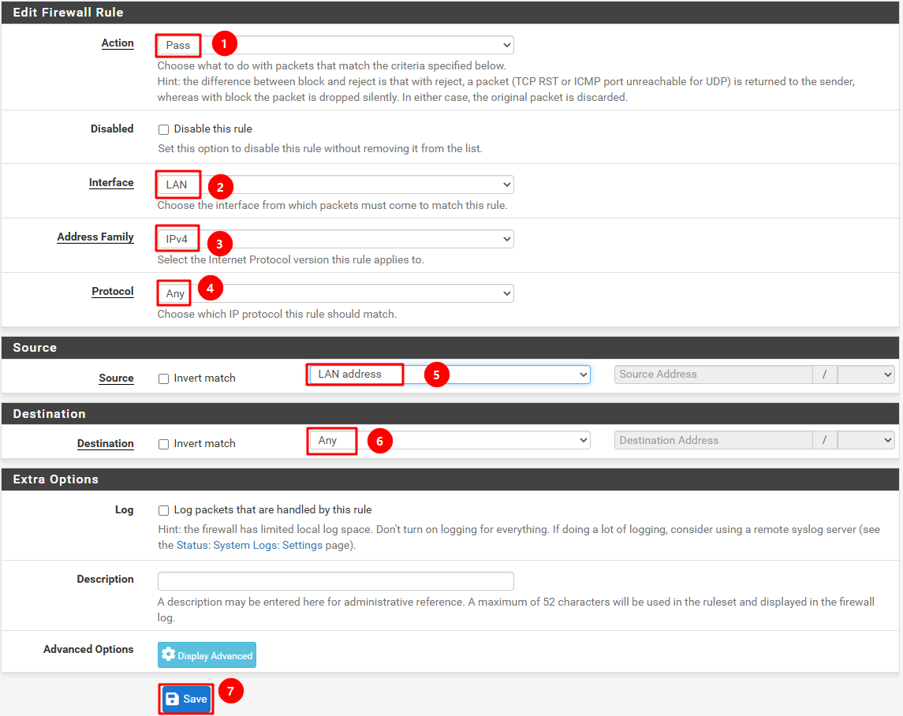

### 3.2 Autoriser les flux sortant de la DMZ

Autoriser l'accès DMZ → WAN :

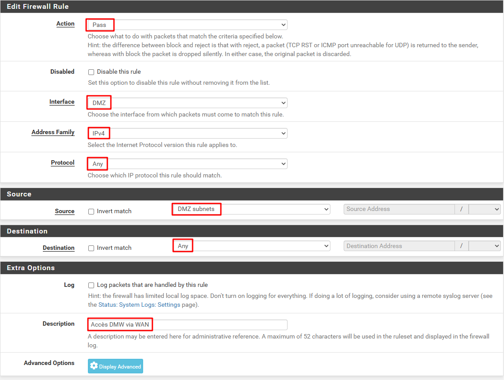

### 3.3 Rediriger les flux entrant depuis le WAN vers le serveur web dans la DMZ

Dans **Firewall** → **NAT**, créer une redirection vers la DMZ :

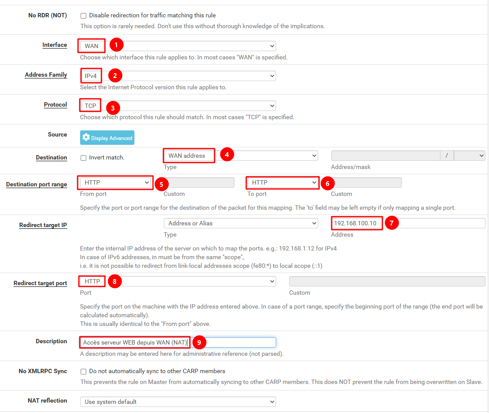

### 3.4 Configurer le NAT Outbound pour autoriser la DMZ à utiliser le WAN

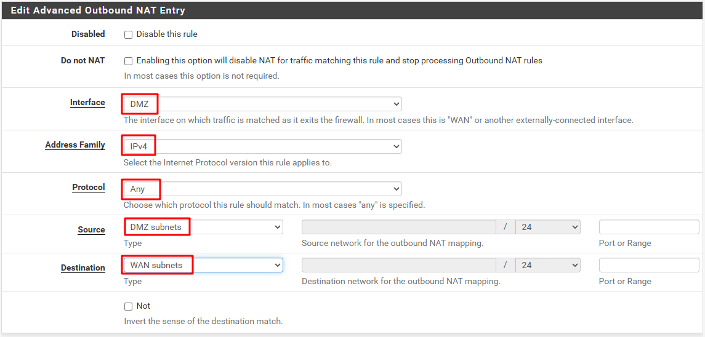

***

## 4. Désactivation du NAT

Aller dans **Firewall** → **NAT** → **Outbound** pour désactiver le NAT si le routage inter-VLAN est géré par le switch CBS250.

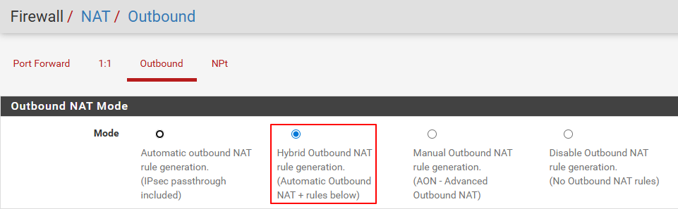
