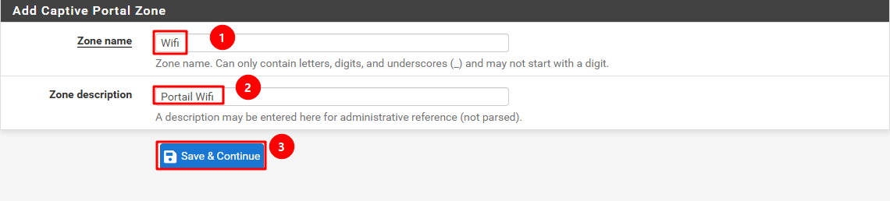
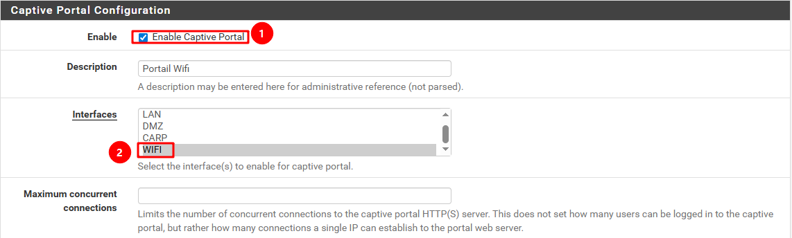
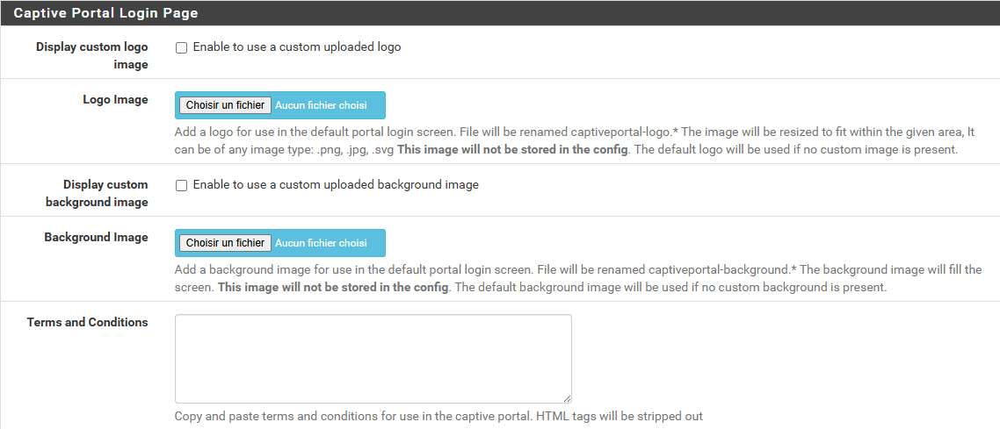
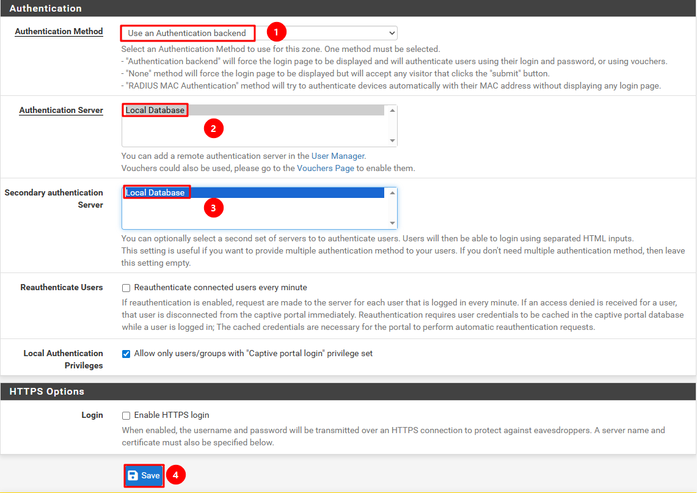
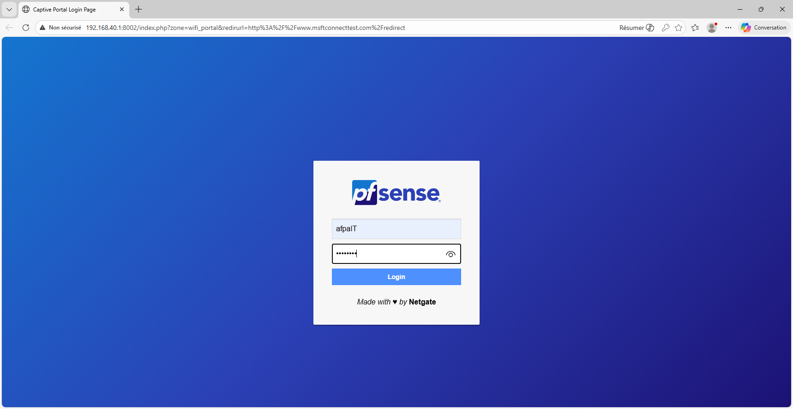
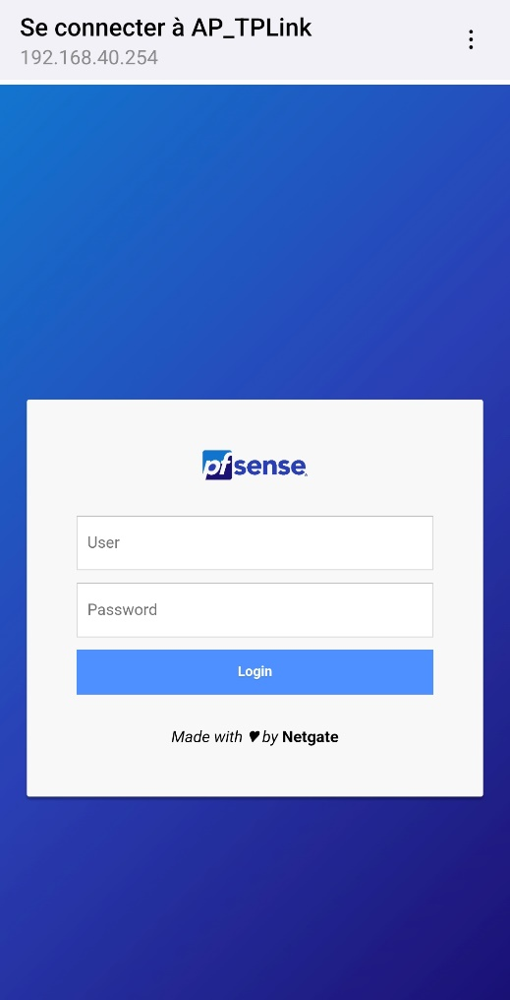

**Auteur :** `=this["Créée par"]`  |  **Date :** `=this["Date de création"]`

***

## Prérequis

Avant d'activer le portail captif, s'assurer que :

* Le **DHCP du VLAN 40** est géré par pfSense (voir [\_Procédures/Centre de documents/pfSense/DHCP](/notes/_procédures/centre-de-documents/pfsense/dhcp))
* La passerelle par défaut du VLAN 40 pointe vers pfSense
* Le serveur **RADIUS** est configuré si l'authentification RADIUS est souhaitée (voir [RADIUS](/notes/_procédures/centre-de-documents/pfsense/radius))

:::note
Le VLAN 40 (Wi-Fi) est exclusivement routé par pfSense. Les VLAN 10, 20 et 30 continuent d'être routés par le switch Cisco CBS250.
:::

***

## 1. Créer une zone de portail captif

1. Aller dans **Services** → **Captive Portal**
2. Cliquer sur **« Add »**
3. Définir le **nom de la zone**
4. Définir une **description**
5. Cliquer sur **« Save and Continue »**

***

## 2. Configurer le portail

1. **Activer** le portail captif
2. Sélectionner les **interfaces concernées** (ex. : VLAN 40 / Wifi)

3. Modifier les paramètres suivants pour personnaliser les images et le logo du portail :

4. Sélectionner un **mode d'authentification**
5. Choisir le **serveur d'authentification** (RADIUS ou local)
6. Choisir un second serveur d'authentification si besoin
7. **Sauvegarder**

***

## 3. Résultat

Les appareils connectés au réseau Wi-Fi ouvrent automatiquement la page du portail captif avant d'accéder à Internet.

