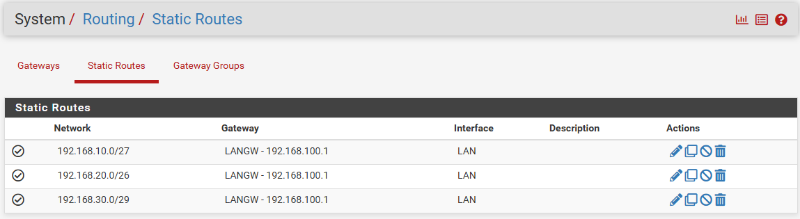
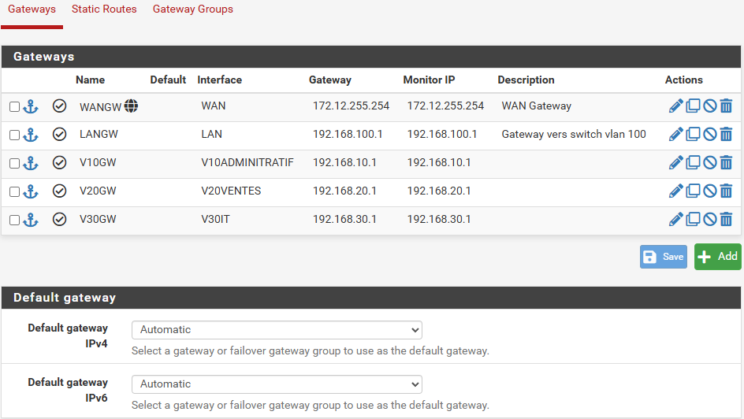

**Auteur :** \['Gautier RAYEROUX', 'Eric JAMET', 'David GEMAIN']  |  **Date :** 2025-01-08

## 1. Création des routes statiques VLAN

Aller dans **System** → **Routing** → **Static Routes** pour créer les routes vers chaque VLAN.

***

## 2. Création des gateways

1. Aller dans **System** → **Routing** → **Gateways**
2. Créer les gateways pour les interfaces **LAN** et **WAN**

:::caution
Laisser la **default gateway IPv4** en mode **« Automatic »**.
:::
