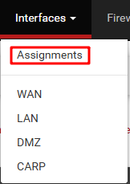
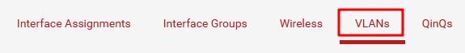
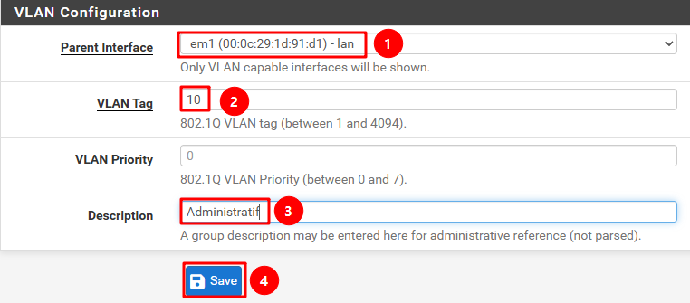
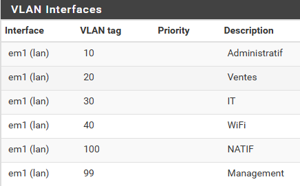
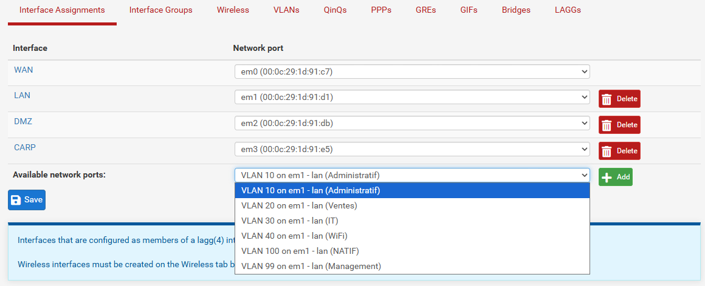
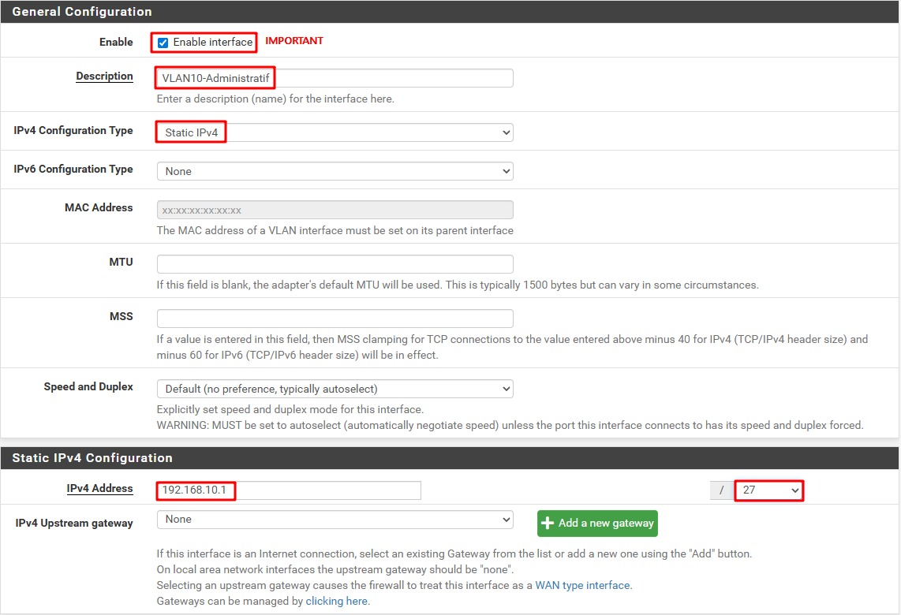

**Auteur :** \['Gautier RAYEROUX']  |  **Date :** 2026-01-15

***

## 1. Création des VLANs

1. Aller dans **Interfaces** → **Assignments**, puis aller dans l'onglet **« VLANs »**
2. Cliquer sur **« Add »**

3. Renseigner les paramètres du VLAN :
   * **Port parent** : interface physique portant le VLAN
   * **Numéro de VLAN** (ID)
   * **Priorité** (802.1p)
   * **Description**

### Tableau des priorités 802.1p

| Priorité | Description               |
| -------- | ------------------------- |
| 0        | Background                |
| 1        | Best Efforts — Par défaut |
| 2        | Excellent Effort          |
| 3        | Critical Applications     |
| 4        | Video                     |
| 5        | Voice                     |
| 6        | Internetwork Control      |
| 7        | Network Control           |

***

## 2. Créer les interfaces VLAN

1. Aller dans **Interfaces** → **Assignments**
2. Ajouter les ports VLAN disponibles (créés à l'étape précédente)

3. Pour chaque interface VLAN créée, configurer l'adresse IP statique correspondante au sous-réseau

4. Répéter pour toutes les interfaces VLAN avec les bons paramètres

***

## 3. Activer un serveur DHCP pour le VLAN Wi-Fi

Voir [\_Procédures/Centre de documents/pfSense/DHCP](/notes/_procédures/centre-de-documents/pfsense/dhcp) pour la configuration complète du serveur DHCP sur le VLAN Wi-Fi.
